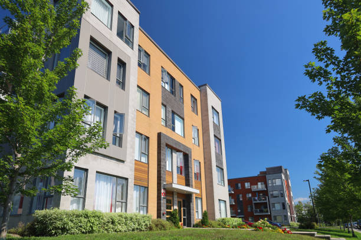

  <!-- Hero Image -->
  

  <!-- Gradient Overlay -->
  

  <!-- Text + Button Overlay -->
  

    

      Strata Solutions One
    

    

      Resident & Maintenance Tracking for Strata Councils
    

    

      <a href="#Overview" style="
        background-color: #2c8fdd;
        color: white;
        padding: 12px 24px;
        border-radius: 6px;
        text-decoration: none;
        font-size: 1.1rem;
        font-weight: 600;
      ">
        View Features
      </a>
    

  

 

 

 
 
*A modern resident and maintenance tracking system for strata councils.*

## A simple, reliable platform that helps councils stay organized, reduce email clutter, and manage day‑to‑day operations with clarity.

## Overview

Strata Solutions One is a streamlined activity and information management system designed specifically for strata councils. It centralizes resident details, maintenance workflows, forms, and building documentation into one clean, predictable interface. No more scattered emails, missing forms, or lost project history — everything is organized, searchable, and easy to maintain.

---

## Forms

Your building’s most common resident requests, all standardized and tracked:

- Move In / Move Out
- Key FOB Requests
- Enterphone Updates
- Visitor Parking
- Renovation Requests
- EV Charging Requests
- Form K Tenancy
- AGM Proxy
- Large Item Delivery

Each form is logged, timestamped, and available for council review at any time.

---

## Project Tracking

Track building projects from start to finish with clear visibility:

- Quotes and contractor proposals
- Approved work and scheduled maintenance
- Invoices and cost tracking
- Task progress and completion history

Everything stays organized and accessible, giving councils a reliable record of past and ongoing work.

---

## Activity Tracking

A complete timeline of building activity:

- Resident submissions
- Administrative updates
- Maintenance events
- Council actions
- Follow‑ups and resolutions

This creates transparency, accountability, and a clear operational history.

---

## Document Management

A centralized hub for your building’s important documents:

- Bylaws
- Council minutes
- AGM minutes
- Announcements
- Owner and resident information

Documents are easy to upload, categorize, and retrieve — no more digging through email threads or shared drives.

---

## Built for Clarity

Strata Solutions One brings your building’s operations together in one simple system.
